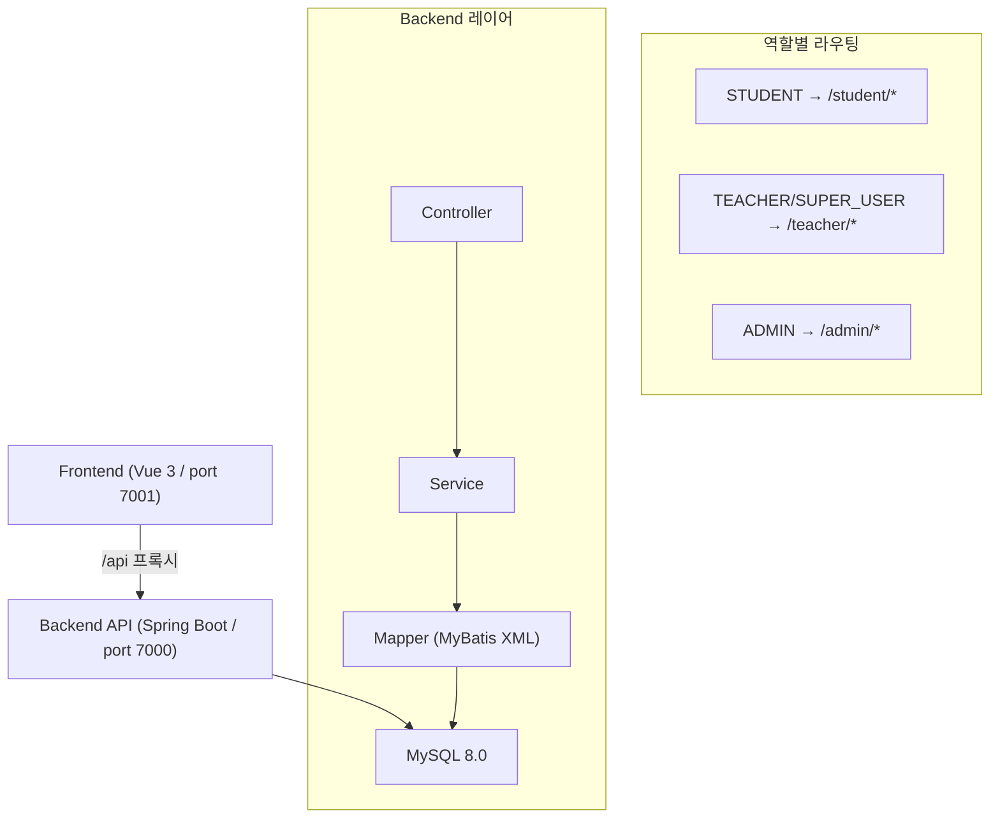

# CLAUDE.md

This file provides guidance to Claude Code (claude.ai/code) when working with code in this repository.

## Project Overview

AI 기반 수학 교육 플랫폼. Spring Boot 백엔드 + Vue 3 프론트엔드 구조.

- **Backend:** `http://localhost:7000/api` (Spring Boot 3.2.3 + MyBatis + JWT)
- **Frontend:** `http://localhost:7001` (Vue 3 + Vite + Pinia)
- **DB:** MySQL 8.0 (`211.171.152.242:3310/edu_platform`, root/root1234)

## Commands

### Backend (Java 17 필수)
```bash
cd backend
./gradlew bootRun          # 개발 서버 실행
./gradlew build            # 빌드
./gradlew test             # 전체 테스트
./gradlew test --tests "com.edu.platform.SomeTest"  # 단일 테스트
```

### Frontend
```bash
cd frontend
npm install                # 의존성 설치
npm run dev                # 개발 서버 (port 7001)
npm run build              # 프로덕션 빌드
npm run preview            # 빌드 결과물 미리보기
```

### Database
```bash
mysql -h 211.171.152.242 -P 3310 -u root -p edu_platform < database/schema.sql
mysql -h 211.171.152.242 -P 3310 -u root -p edu_platform < database/seed.sql
```

## Architecture



### 사용자 역할 및 접근 구조
- `STUDENT` → `/student/*`
- `TEACHER` / `SUPER_USER` → `/teacher/*`
- `ADMIN` → `/admin/*`

라우터 가드(`frontend/src/router/index.js`)에서 역할별 자동 리다이렉트 처리.

### Backend 레이어 구조
```
Controller → Service → Mapper (MyBatis XML) → DB
```
- **Controller:** `backend/src/main/java/com/edu/platform/controller/`
- **Service:** `backend/src/main/java/com/edu/platform/service/`
- **MyBatis Mapper XML:** `backend/src/main/resources/mapper/`
- **Domain/DTO:** `domain/`, `dto/{admin,auth,common,student,teacher}/`

모든 API 응답은 `ApiResponse<T>` 래퍼로 통일. 예외는 `BusinessException(ErrorCode)` 사용.

### Frontend 구조
- **Pages:** `frontend/src/pages/{student,teacher,admin,auth,common}/`
- **Store (Pinia):** `frontend/src/store/` — `auth.js`가 JWT 토큰 및 사용자 상태 관리
- **API 호출:** `frontend/src/composables/` 또는 axios 직접 사용 (`/api` 프록시)
- **레이아웃:** `DefaultLayout.vue` (인증 후), `AuthLayout.vue` (로그인/회원가입)

### 인증 흐름
1. 로그인 → Access Token + Refresh Token 발급
2. Access Token은 `Authorization: Bearer {token}` 헤더로 전송
3. 만료 시 `/auth/refresh`로 갱신
4. `JwtAuthenticationFilter`가 모든 요청에서 토큰 검증

### 학습 세션 흐름
1. `POST /student/sessions/start` → sessionId 발급
2. `GET /student/sessions/{sessionId}/problems` → 문제 목록
3. `POST /student/sessions/{sessionId}/submit` → 문항별 답 제출
4. `POST /student/sessions/{sessionId}/complete` → 세션 종료 및 리포트 생성

### MyBatis 규칙
- XML mapper와 Java Mapper 인터페이스가 쌍으로 존재
- `application.yml`의 `map-underscore-to-camel-case: true` 설정으로 snake_case → camelCase 자동 변환
- SQL 로그는 DEBUG 레벨로 출력됨

## 절대 규칙

**어떤 상황에서도 반드시 지킬 것.**

- 프로덕션 DB 직접 수정 금지 — 스키마 변경은 반드시 `database/schema.sql`을 통해
- `.env` 및 환경변수 파일 커밋 금지
- 승인 없이 DB 스키마 변경 금지 (테이블 추가/삭제/컬럼 변경)
- 승인 없이 기존 API 응답 구조 변경 금지 (하위 호환성 깨짐 방지)

## 코딩 컨벤션

### Backend
- 모든 API 응답은 `ApiResponse<T>` 래퍼로 통일
- 예외는 반드시 `BusinessException(ErrorCode)` 사용
- Controller → Service → Mapper 레이어 순서 준수
- DTO는 `dto/{역할}/{기능}` 경로에 위치 (예: `dto/student/WrongNoteDto.java`)
- MyBatis XML mapper와 Java Mapper 인터페이스는 반드시 쌍으로 생성

### Frontend
- Vue 컴포넌트 파일명은 PascalCase (예: `WrongNote.vue`)
- API 호출은 `composables/` 또는 axios 직접 사용 (`/api` 프록시)
- 상태 관리는 Pinia store 사용
- 신규 페이지 추가 시 `router/index.js`에 역할별 가드 반드시 설정

## Key Configuration

환경변수로 주입되는 민감 설정 (`application.yml`):
- `JWT_SECRET` — 기본값 있음(개발용)
- `MAIL_USERNAME`, `MAIL_PASSWORD` — Gmail SMTP
- `AWS_S3_BUCKET`, `AWS_REGION`, `CLOUDFRONT_DOMAIN` — S3 업로드 시 필요
- `UPLOAD_PATH` — 로컬 파일 업로드 경로 (기본: `uploads/`)

## Hooks 설정

### 작업 완료 알림
긴 작업 처리 중 다른 작업을 하다가 완료 시점을 놓치지 않도록 Stop 이벤트에 알림 훅 설정.
CLI에서 아래 요청으로 생성:
```
"작업이 완료되면 Windows 알림을 보내는 훅 만들어줘"
```

### Post-tool-use 자동 포맷
파일 수정 후 자동 포맷터 실행. CLI에서 아래 요청으로 생성:
```
"Java 파일 수정 후 자동으로 ./gradlew spotlessApply 실행하는 훅 만들어줘"
```

> 훅 설정 파일 위치: `.claude/hooks.json`
> 훅 목록 확인: `/hooks`

## 참조 문서 (레이지 로딩)

상세 내용은 아래 파일을 필요할 때만 읽을 것. CLAUDE.md에 모두 넣지 않음.

- 구현 현황 및 TODO 전체: `PROJECT_CONTEXT.md`
- DB 스키마 상세: `database/schema.sql`
- 작업 단위 쪼개기 기준: `PROJECT_CONTEXT.md` → **작업 단위 원칙** 섹션

## 세션 종료 전 루틴

**매 작업 세션 종료 전에 반드시 아래 순서로 실행할 것.**

### 1단계 — PROJECT_CONTEXT.md 업데이트
```
오늘 작업 내용 반영해서 PROJECT_CONTEXT.md 업데이트해줘.
구현 완료된 항목 체크, 새로 발견된 이슈나 미구현 항목 추가.
```

업데이트 기준:
- 이번 세션에서 구현 완료된 기능 → `- [ ]` 를 `- [x]` 로 변경
- TODO에서 완료된 항목 → 해당 행 제거
- 새로 발견된 미구현 기능, 버그, 이슈 → TODO 적절한 섹션에 추가
- 새로 생성된 페이지/API 경로 → 프론트엔드 페이지 현황 테이블에 추가

### 2단계 — Git 커밋 및 푸시
PROJECT_CONTEXT.md 업데이트 완료 후 자동으로 아래를 실행할 것.
```bash
git add .
git commit -m "feat: [오늘 구현한 기능명 한 줄 요약]"
git push origin dev
```

커밋 메시지 prefix 규칙:
- `feat:` 새 기능 구현
- `fix:` 버그 수정
- `refactor:` 코드 개선
- `docs:` 문서(PROJECT_CONTEXT.md 등) 변경만 있을 때
- `chore:` 설정 변경

### 3단계 — 컨텍스트 초기화
```
/clear
```

### 목적
- `PROJECT_CONTEXT.md` — 다음 세션에서 Claude가 컨텍스트를 이어받기 위한 유일한 파일
- Git 커밋 — 기능 단위 이력 보관 및 문제 발생 시 롤백 기준점 확보
- `/clear` — 다음 세션을 깨끗한 토큰 상태로 시작
